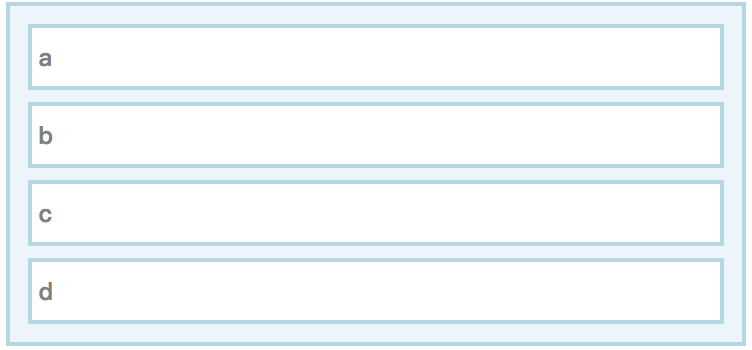
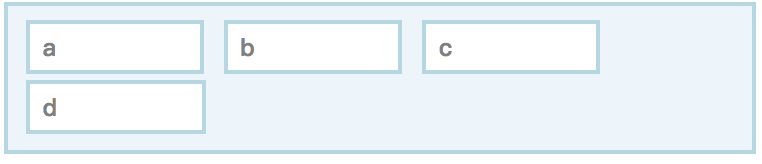
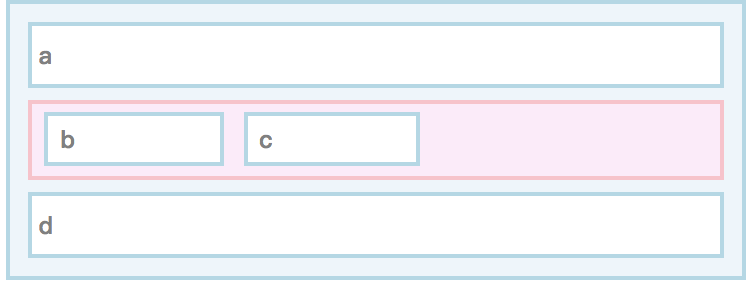

2014年9月8日

# 让我们构建一个浏览器引擎!

## 第5部分: 盒子

这是关于编写简单HTML呈现引擎的系列文章中的最新内容: 

> -   [第1部分: 入门](0.zh.md)
> -   [第2部分: HTML](1.zh.md)
> -   [第3部分: CSS](2.zh.md)
> -   [第4部分: style](3.zh.md)
> -   **第5部分: 盒子**
> -   [第6部分: 块布局](5.zh.md)
> -   [第7部分: 绘画101](6.zh.md)

本文将开始[布局](https://github.com/mbrubeck/robinson/blob/master/src/layout.rs)模块,它采用 样式树并将其转换为二维空间中的一组矩形. 这是一个很大的模块,所以我将把它分成几篇文章. 此外,我在本文中分享的一些代码可能需要在 编写后面部分的代码时 进行更改. 

布局模块的输入是来自的样式树[第4部分](3.zh.md),它的输出又是另一棵树了*布局树*. 这使我们在 迷你渲染管道中更上一层楼: 


我将首先讨论基本的 HTML/CSS 布局模型. 如果您已经学会了开发网页,您可能已经熟悉了这一点 - 但它可能与实现的观点略有不同. 

## 盒子模型

布局就是这样*盒子*. 框是网页的矩形部分. 它有宽度,高度和页面上的位置. 这个矩形叫做*内容区域*,因为它是绘制盒子内容的地方. 内容可以是文本,图像,视频或其他框. 

盒子也可能有*填充-padding*,*边界-borders*,和*页边空白-margins*围绕其内容区域. CSS规范有一个[图样](http://www.w3.org/TR/CSS2/box.html#box-dimensions)展示所有这些层如何组合在一起. 

下面,罗宾逊建立 盒子的内容区域和周围区域 的结构. \[**rust 注意:** `f32`是32位浮点类型. ]
``` rust
    // CSS盒子模型。 所有尺码均为px。

    struct Dimensions {
        // 内容区域相对于原 document 的位置:
        content: Rect,

        // 周边边缘：
        padding: EdgeSizes,
        border: EdgeSizes,
        margin: EdgeSizes,
    }

    struct Rect {
        x: f32,
        y: f32,
        width: f32,
        height: f32,
    }

    struct EdgeSizes {
        left: f32,
        right: f32,
        top: f32,
        bottom: f32,
    }
```
## 块和内联布局

**注意:**本节包含的图表,如果您在没有 相关视觉样式 的情况下阅读它们将没有意义. 如果您在 Feed阅读器 中阅读此内容,请尝试打开[原始页面](https://limpet.net/mbrubeck//2014/09/08/toy-layout-engine-5-boxes.html)在常规浏览器选项卡中. 我还为使用 屏幕阅读器或其他辅助技术的人员 提供了文字说明. 

CSS[`display`](https://developer.mozilla.org/en-US/docs/Web/CSS/display)属性 确定元素生成的框的类型. CSS定义了几种盒子类型,每种类型都有自己的布局规则. 我只想谈谈其中两个: *块-block*和*内联-inline*. 

我将使用这段 伪HTML 来说明差异: 
``` html
    <container>
      <a></a>
      <b></b>
      <c></c>
      <d></d>
    </container>
```
*块盒*从顶部到底部 垂直放置 在容器内. 
``` css
    a, b, c, d { display: block; }
```
**描述:**下图显示了垂直堆栈中的四个矩形. 



*内联框*水平放置在容器内,从左到右. 如果它们到达容器的右边缘,它们将环绕,并继续在下面的新线上. 
``` css
    a, b, c, d { display: inline; }
```
**描述**下图显示了框`a`,`b`,和`c`从左到右的水平线和 方框`d`在下一行. 




每个盒子必须包含*只要*块孩子,或*只要*内联儿童. 当 DOM元素包含 块和内联子元素的混合时,布局引擎将插入[匿名框](http://www.w3.org/TR/CSS2/visuren.html#anonymous-block-level)分开这两种类型.  (这些框是"匿名的",因为它们与 DOM树中的节点 无关. ) 

在此示例中,内联框`b`和`c`被*匿名块框*包围,以粉色显示: 
``` css
    a    { display: block; }
    b, c { display: inline; }
    d    { display: block; }
```
**描述:**下图显示了垂直堆栈中的三个框. 第一个被贴上标签`a`;第二个包含标记为 水平行的两个方框`b`和`c`;堆栈中的第三个框被标记`d`. 




请注意,内容默认会*垂直*增长. 也就是说,将儿童 添加到容器通常会使其更高,而不是更宽. 另一种说法是,默认情况下,块或行的宽度 取决于 其容器的宽度,而容器的高度取决于 其子容器 的高度. 

如果覆盖类似`width`和`height`属性的默认值,这会变得更复杂,和如果*尝试*想支持像[垂直写作](http://dev.w3.org/csswg/css-writing-modes/)这样的功能更复杂. 

## 布局树

布局树是一组框. 一个盒子有尺寸,它可能包含子盒子. 
``` rust
    struct LayoutBox<'a> {
        dimensions: Dimensions,
        box_type: BoxType<'a>,
        children: Vec<LayoutBox<'a>>,
    }
```
框可以是 块节点,内联节点或匿名块框.  (当我实现文本布局时,这将需要更改,因为换行可能会导致 单个内联节点分成多个框. 但它现在会做. ) 
``` rust
    enum BoxType<'a> {
        BlockNode(&'a StyledNode<'a>),
        InlineNode(&'a StyledNode<'a>),
        AnonymousBlock,
    }
```
要构建布局树,我们需要查看每个DOM节点的`display`属性. 我添加了一些代码到`style`模块获得的节点的`display`值. 如果没有指定值,则返回初始值. `'inline'`
``` rust
    enum Display {
        Inline,
        Block,
        None,
    }

    impl StyledNode {
        // 如果属性返回指定的属性值存在, 或者 `None`.
        fn value(&self, name: &str) -> Option<Value> {
            self.specified_values.get(name).map(|v| v.clone())
        }

        // `display`属性的值（默认为inline).
        fn display(&self) -> Display {
            match self.value("display") {
                Some(Keyword(s)) => match &*s {
                    "block" => Display::Block,
                    "none" => Display::None,
                    _ => Display::Inline
                },
                _ => Display::Inline
            }
        }
    }
```
现在我们可以遍历样式树,为每个节点构建一个`LayoutBox`,然后为节点的子节点插入框. 如果一个节点`display`属性设置为`'none'`,那么它不包含在布局树中. 
``` rust
    // 构建LayoutBoxes树，但不执行任何操作布局计算.
    fn build_layout_tree<'a>(style_node: &'a StyledNode<'a>) -> LayoutBox<'a> {
        // 创建根框。
        let mut root = LayoutBox::new(match style_node.display() {
            Block => BlockNode(style_node),
            Inline => InlineNode(style_node),
            DisplayNone => panic!("Root node has display: none.")
        });

        // 创建后代框。
        for child in &style_node.children {
            match child.display() {
                Block => root.children.push(build_layout_tree(child)),
                Inline => root.get_inline_container().children.push(build_layout_tree(child)),
                DisplayNone => {} // 跳过节点`display: none;`
            }
        }
        return root;
    }

    impl LayoutBox {
        // 构造函数
        fn new(box_type: BoxType) -> LayoutBox {
            LayoutBox {
                box_type: box_type,
                dimensions: Default::default(), // 原来set all fields to 0.0
                children: Vec::new(),
            }
        }
        // ...
    }
```
如果块节点 包含 内联子节点,请创建一个匿名块框以包含它. 如果连续有多个内联子项,请将它们全部放在同一个匿名容器中. 
``` rust
    // 新的内联孩子应该去哪里。
    fn get_inline_container(&mut self) -> &mut LayoutBox {
        match self.box_type {
            InlineNode(_) | AnonymousBlock => self,
            BlockNode(_) => {
                // 如果我们刚刚生成一个匿名者block box, keep using it.
                // 否则，创建一个新的。
                match self.children.last() {
                    Some(&LayoutBox { box_type: AnonymousBlock,..}) => {}
                    _ => self.children.push(LayoutBox::new(AnonymousBlock))
                }
                self.children.last_mut().unwrap()
            }
        }
    }
```
这有点从 标准CSS中 以多种方式简化的[盒子一代](http://www.w3.org/TR/CSS2/visuren.html#box-gen)算法 例如,它不处理 内联框 包含 块级子项 的情况. 此外,如果块级节点仅具有内联子节点,则会生成不必要的匿名框. 

## 未完待续ⅆ

哇,这比我预期的要长. 

我想我现在就到此为止,但不要担心: [第6部分](5.zh.md)即将推出,并将涵盖 块级布局. 一旦 块布局 完成,我们就可以跳到管道的下一个阶段: 绘画!

我想我可能会这样做,因为我们终于可以看到 渲染引擎的输出是漂亮的图片 而不仅仅是数字. 但是,除非我们通过实现 内联布局和文本布局来 完成布局模块,否则图片将只是一堆彩色矩形. 

如果我在绘画之前,没有实现这些,我希望以后回到他们身边. 
